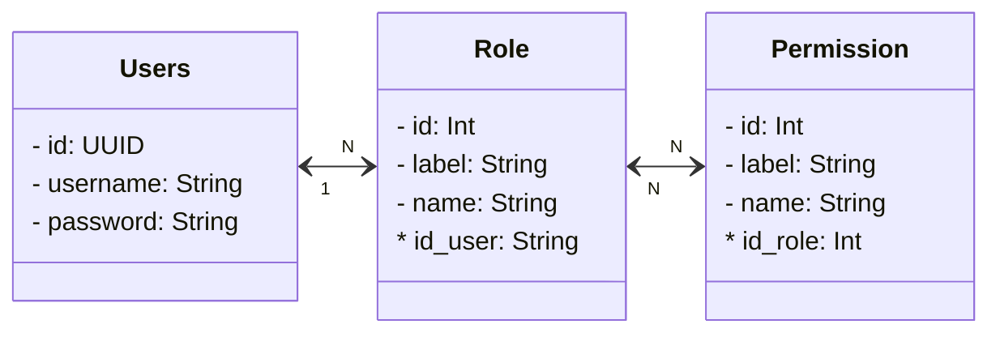

# klikcare-services


## Cara Running Development

* Linux
```bash
export SPRING_DATASOURCE_URL=jdbc:mysql//{ip_database:port}/{nama_database}
export SPRING_DATASOURCE_USERNAME={user_db}
export SPRING_DATASOURCE_PASSWORD={password_db}
mvn clean spring-boot:run
```



# ICON TOP

## DISPLAY ANTRIAN
## BUKU PANDUAN
## 
# MENU UTAMA
 ## PENDAFTARAN
  ### Data Pasien
  ### Pendaftaran
  ### Pasien Hari Ini
  ### Jadwal Prakter
  ### 

 ## PELAYANAN
 ### Data Pasien Berobat
 ### Persuratan
### Riwayat Pasien
### Report Pelayanan

 ## FARMASI 
### Penjualan
### Penjualan Langsung
### Cetak Etiket
### Pemakaian BHP
### Mutasi Stok
### Adjustment Stok
### Purchase Order
### Pembelian Dari PO
### Pembelian Langsung
### Pembayaran Hutang
### Report Apotik
### Report Stock

 ## KASIR
 ## KEUANGAN
 ## LAPORAN
 ## MASTER
## HELPDESK


# MENU ICON
### display antrian dokter


## Pcare-Api

### 1. Create Signature
### 2. Decrypt
### 3. Diagnosa

#### URL: _{Base URL}_/_{Service Name}_/diagnosa/**{Parameter 1}**/**{Parameter 2}**/**{Parameter 3}**

Fungsi : Get Data Diagnosa

Method :  **GET**

Format :  **Json**

Content-Type:  **application/json; charset=utf-8**

Parameter 1 :  **Kode atau nama diagnosa**

Parameter 2 :  **Row data awal yang akan ditampilkan**

Parameter 3 :  **Limit jumlah data yang akan ditampilkan**

```json
{
  "response": {
    "count": 33,
    "list": [
      {
        "kdDiag": "A001",
        "nmDiag": "Cholera due to vibrio cholerae 01, biovar eltor",
        "nonSpesialis": false
      },
      {
        "kdDiag": "B001",
        "nmDiag": "Herpesviral vesicular dermatitis",
        "nonSpesialis": true
      }
    ]
  },
  "metaData": {
    "message": "OK",
    "code": 200
  }
}
```

## Dokter
### Get Dokter
### _{Base URL}_/_{Service Name}_/dokter/**{Parameter 1}**/**{Parameter 2}**

Fungsi : Get Data Dokter

Method :  **GET**

Format :  **Json**

Content-Type:  **application/json; charset=utf-8**

Parameter 1 :  **Row data awal yang akan ditampilkan**

Parameter 2 :  **Limit jumlah data yang akan ditampilkan**

```json
{
  "response": {
    "count": 19,
    "list": [
      {
        "kdDokter": "001",
        "nmDokter": "dr..."
      },
      {
        "kdDokter": "002",
        "nmDokter": "dr. Muna Hasnita Harahap"
      },
      {
        "kdDokter": "003",
        "nmDokter": "dr. fauzi"
      }
    ]
  },
  "metaData": {
    "message": "OK",
    "code": 200
  }
}
```
Kelompok
Kesadaran
Kunjungan
MCU
Obat
Pendaftaran
## Peserta
### catatan Bridging ini auto fill ketika nik atau no bpjs sudah di isikan, tombol get data di samping form isian nik, form yang bisa di get yaitu

#### 1. noKartu
#### 2. nama

#### 3. sex
#### 4. tglLahir


#### [Get Peserta by Jenis Kartu](https://dvlp.bpjs-kesehatan.go.id:8888/trust-mark/#collapsegetpeserta2)

### _{Base URL}_/_{Service Name}_/peserta/**{Parameter 1}**/**{Parameter 2}**

Fungsi : Get Data Peserta

Method :  **GET**

Format :  **Json**

Content-Type:  **application/json; charset=utf-8**

Parameter 1 :  **Jenis Kartu: nik / noka**

Parameter 2 :  **Nomor NIK atau kartu peserta sesuai dengan Parameter 1**

```json                          
{
  "response": {
    "noKartu": "0001261832477",
    "nama": "TRI ARNI",
    "hubunganKeluarga": "Istri",
    "sex": "P",
    "tglLahir": "29-09-1965",
    "tglMulaiAktif": "09-01-2014",
    "tglAkhirBerlaku": "31-12-2050",
    "kdProviderPst": {
      "kdProvider": "09020107",
      "nmProvider": "KEL. MANGGARAI SELATAN"
    },
    "kdProviderGigi": {
      "kdProvider": null,
      "nmProvider": null
    },
    "jnsKelas": {
      "kode": "3",
      "nama": "KELAS III"
    },
    "jnsPeserta": {
      "kode": "22",
      "nama": "PBI (APBD)"
    },
    "golDarah": "0",
    "noHP": "083876592594",
    "noKTP": "3174016909650001",
    "aktif": true,
    "ketAktif": "AKTIF",
    "asuransi": {
      "kdAsuransi": null,
      "nmAsuransi": null,
      "noAsuransi": null
    },
				"tunggakan": 0
  },
  "metaData": {
    "message": "OK",
    "code": 200
  }
}
```

Poli
Provider
Spesialis
Status Pulang
Tindakan
